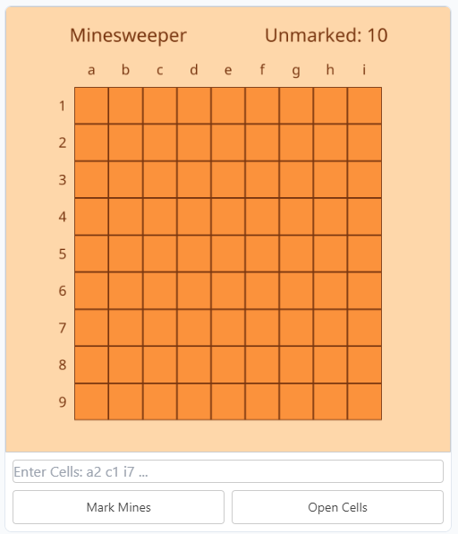

# Frame Sweeper
This is an implementation of Minesweeper which runs in a Farcaster frame. Built with [`frames.js`](https://framesjs.org/) and [`Next.js`](https://nextjs.org/). Hosted on [Vercel](https://vercel.com) and deployed at [https://frame-sweeper.vercel.app](https://frame-sweeper.vercel.app) for public use. I wanted to try using the following features for this frame:
- Different aspect ratios
- Processing text input
- State management
- Require follow to play  

Went with a Solarized inspired colorscheme for this one.

